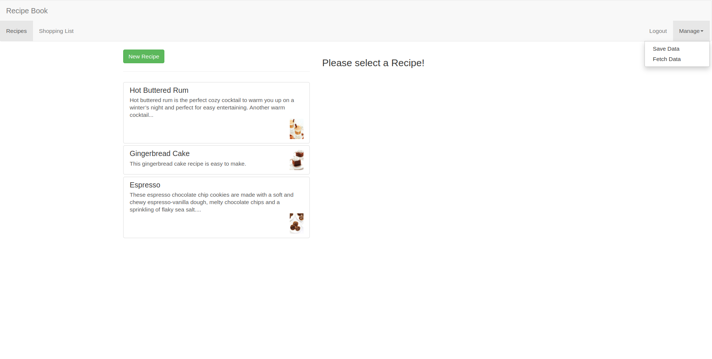
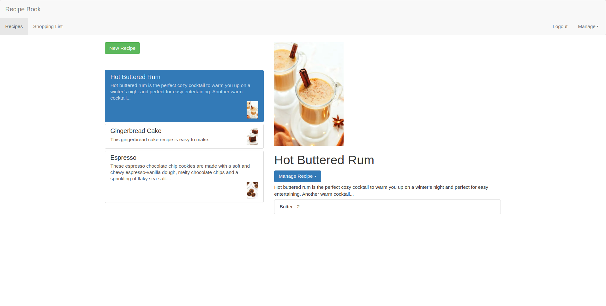
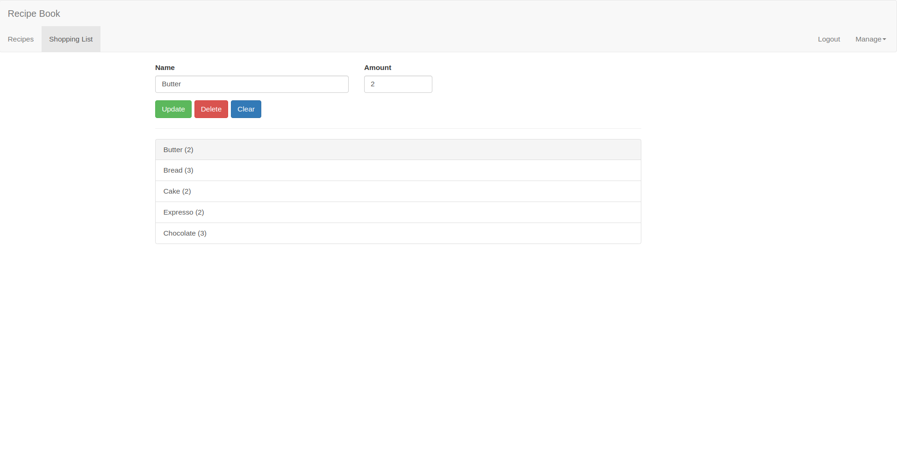

# Shopping List Website

Shopping book website is a website for different recipes, you can see recipes, create recipes and save your recipes.

You can add each recipe ingredients to shopping list to buy them later.

## Authentication

You should signup first, to be able to see the recipes, also you can logout after you logged in.

## Installation

You can run the app by following command:
```bash
    docker compose up --build
```

The application is then available on `http://localhost:4200`

## Technologies

Backend:

* NodeJS & Typescript

Frontend:

* AngularJS

Database:

* Mongodb

Backend and FrontEnd have their own automated tests.

## App Pictures

Manage your recipes:



---
Recipes:



---
Shopping List:


